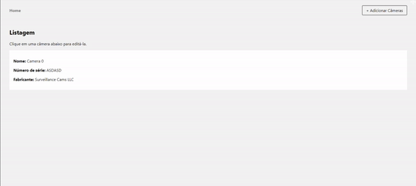

# Desafio Octos

Este é um app fullstack utilizando Next.js, React (frontend) e Prisma Client. Foi utilizado um banco de dados SQLite. 

## Como Utilizar

### 1. Baixe o repositório e instale dependências
Baixe o repositório:

```
git clone https://github.com/caroluchoa/octos.git</blockquote>
```
Instale dependências:

```
npm install
```

### 2. Inicie o servidor de desenvolvimento
```
npm run dev
```

O aplicativo está rodando agora em http://localhost:3000/


### 3. Crie uma tabela no SQLite
Crie uma tabela executando a query a seguir:

```
CREATE TABLE "Cameras" (
  "id" INTEGER NOT NULL PRIMARY KEY AUTOINCREMENT,
  "cameraname" VARCHAR(50) NOT NULL,
  "serialnumber" VARCHAR2(16) NOT NULL,
  "manufacturer" VARCHAR(50) NOT NULL
);
```
### 4. Atualize o database schema do Prisma
O esquema Prisma precisa ser atualizado para o funcionamento correto da API Prisma Client. Para isso, utilize:

```
npx prisma introspect
```

Com o esquema atualizado, você deve atualizar a API Prisma Client utilizando:
```
npx prisma generate
```

Agora é possível utilizar a instância do PrismaClient para performar operações na tabela criada.


